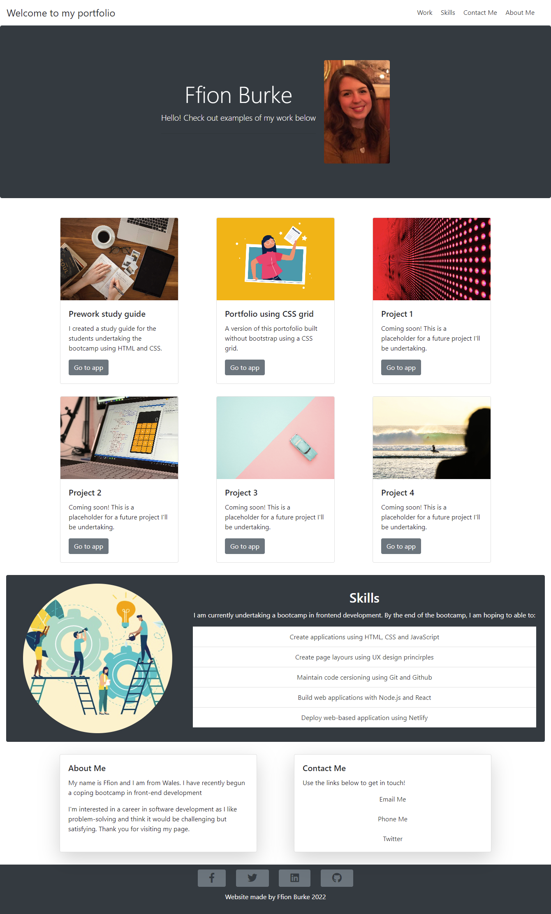

# bootstrap-portfolio

## Description
A professional portfolio made using bootstrap to introduce otheres to me, my work, and my contact information. The web application contains:

* A navigation bar with links to the various sections
* A recent picture of me
* 'Work', 'Skills', 'About Me'  and 'Contact Me' sections
* Links within the 'work' sections to my other projects (or placeholder links)
* Links to ways to contact me
* Hover effects on buttons and links

The website is responsive to different screen sizes. 

## Screenshot

## Link to deployed website

https://github.com/ffionerin/bootstrap-portfolio